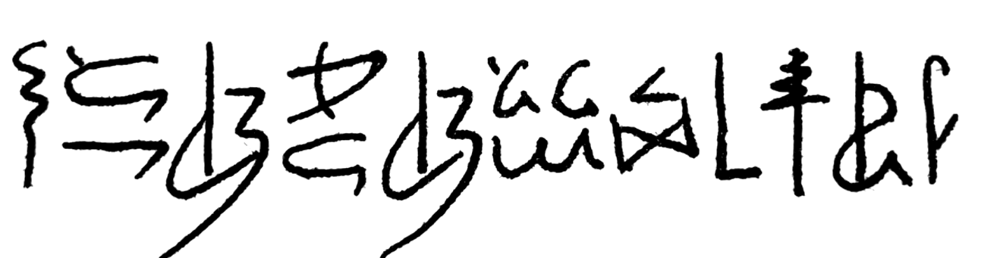

# HieraticBench

**Can AI read ancient Egyptian handwriting?**

Started by [Aly Moursy](https://github.com/alymoursy), Founder of [Veeza AI](https://veeza.ai) (YC F26). Live at [hieraticbench.vercel.app](https://hieraticbench.vercel.app).



In 2022 I asked an Oxford Egyptology professor to write me one sentence in hieratic, the cursive script ancient Egyptians used for letters, accounts, medicine, maths and stories for more than three thousand years. Hieroglyphs were for monuments. Hieratic was for everything else.

Every AI model I have shown it to fails. Most can't even name the script. Claude Opus 5.5 checked it against Tangut, Khitan, Jurchen, Nüshu and Gregg shorthand, and never once against Egypt. Claude Fable 5.1 decided it wasn't a real writing system. Claude Haiku 4.5 called it Urdu and translated it as "One should learn every day."

The goal isn't my sentence. It's hieratic. The sentence is the exam. Its answer has never been published, so a model can only pass by actually reading the script. HieraticBench measures how close AI is to reading hieratic, from naming the script to reading single signs to translating, and asks for help getting there. When a model can really read hieratic, it will read the sentence too.

## Results so far

Run on 5 October 2026, Claude through Anthropic's API and every other model through OpenRouter, at high reasoning effort where offered. Some rows are partial to keep costs down. Reading the sentence isn't scored, because no answer is stored anywhere.

| Model | Names the script of the sentence | Names the script of real documents | Reads single signs |
|---|---|---|---|
| Claude Opus 5.5 | 0% | 95% | 13% |
| Claude Fable 5.1 | 0% | 95% | 8.7% |
| Claude Sonnet 5.5 | 0% | 94% | 11% |
| Kimi K3 | 0% | 84% | not run |
| Qwen3.8 Max | 0% | 81% (53 of 87) | not run |
| GPT-6.1 Sol | 0% | 79% | not run |
| Llama 4 Maverick | 0% | 61% | not run |
| Mistral Medium 3.5 | 0% | 46% | not run |
| Claude Haiku 4.5 | 0% | 43% | 0.7% |
| Grok 4.7 | 0% | 25% | not run |
| GPT-6 Astra | 0% | not run | not run |
| Gemini 3.1 Pro | 0% | not run | not run |
| Gemini 3.8 Flash | 0% | not run | not run |

The best models recognise hieratic on real papyri and printed facsimiles almost every time. On the professor's sentence, not one of the 13 named it, across 78 tries between them. Their guesses included Urdu, Tibetan, Hangul, Mongolian, Paleo-Hebrew, Rongorongo and Nüshu. The full table is on the website, and the raw answers are in `results/runs/`. Help us fill the gaps.

## The ladder

Each item is asked at up to four depths. Identify is asked cold. Every later rung tells the model it is looking at hieratic.

| Rung | Question | Scored by |
|---|---|---|
| 1. Identify | What writing system is this? | Script label. 1 right, 0.5 for another Egyptian script, 0 otherwise |
| 2. Signs | Which hieroglyph is each sign? | Gardiner codes. Exact match, or 1 minus sign error rate for a sentence |
| 3. Transliterate | How does it sound? | Not scored on the sentence, since no answer is stored. Ready for future public texts |
| 4. Translate | What does it say? | Not scored on the sentence either. Ready for future public texts |

What the sentence says is **sealed**. It has never been published and no answer key exists anywhere, so no model can have memorised it. See [site/src/app/method/page.tsx](site/src/app/method/page.tsx) or the Method page on the site for the full protocol.

## The dataset

- `data/items/*.json` holds one record per item, with source, license and attribution. Schema in [data/SCHEMA.md](data/SCHEMA.md).
- `data/images/` holds the images, resized for evaluation.
- Two sealed items: the professor's sentence (`hb-0001`) and the same sentence in a period-style hand by a hieratic specialist (`hb-0002`).
- A public identification set of openly licensed hieratic documents, with controls in demotic and hieroglyphs. Collection notes live in `data/sources/`.

## Run it

Requires Node 22 or newer.

```bash
npm install
cp .env.example .env            # add a key for any provider you want to run
npm test                        # scoring unit tests
npm run bench -- run --models claude-opus-5-5 --samples 3
npm run bench -- leaderboard    # rebuilds results/leaderboard.json
npm run dev                     # the website, at http://localhost:3000
```

Model shortcuts are listed by `npm run bench -- models`. Shortcuts cover Claude directly and other labs' flagships through OpenRouter (`gpt-6-astra`, `gemini-3.1-pro`, `grok-4.7` and more). Anything else runs as `provider:model-id`, with provider one of `anthropic`, `openai`, `google` or `openrouter`, for example `openrouter:qwen/qwen3.8-flash`.

Useful flags are `--rungs identify`, `--items hb-,wm-`, `--limit 5` for a smoke test, `--effort max`, and `--dry-run` to print the plan and the first prompt.

### Where results go

- Openly scored answers (the identify rung, and public sign items) go to `results/runs/<run>.jsonl`. Commit these.
- On the sentence, even the identify answer can contain a translation attempt, so the public file keeps only the script named and the score.
- Answers about the sentence go to `results/inbox/<run>.jsonl`, which is gitignored, because a correct reading would give the answer away. **Don't open a public PR with these.** Keep the file private.

## Deploy the site

The site is a static export. On Vercel, import the repository and set the Root Directory to `site`. The build runs `npm run sync` first, which copies `results/leaderboard.json` and the item images into the app, so rebuild the leaderboard before deploying. Any static host works too, since `npm run build` writes plain files to `site/out/`.

Site links (GitHub, contact email, domain) live in one file, `site/src/lib/site.ts`.

## Contribute

Anyone can add a model, add images, or write a sealed sentence, with no permission needed. Work in your fork, open a pull request, and CI checks it. Merging updates the leaderboard and the site automatically. **[CONTRIBUTING.md](CONTRIBUTING.md)** has the steps.

- **Egyptologists.** Write a new sealed sentence, or annotate signs in a published papyrus.
- **AI researchers.** Run the harness on any model with your own key and send the results.
- **Everyone.** Share it, introduce us to an Egyptologist, or sponsor a commissioned sentence.

## Repository layout

```
bench/     evaluation harness (TypeScript, official provider SDKs)
data/      items, images, schema, source notes
results/   run logs, the leaderboard, chat-app spot checks
site/      the website (Next.js, static export)
```

## License

- **Code** in `bench/` and `site/` is MIT.
- **Results** in `results/` (run logs, leaderboard, spot checks) are CC BY 4.0. Reuse and cite them with credit to HieraticBench.
- **Public images** keep the license their source states, recorded in each item file in `data/items/`.
- **The two commissioned images** (`hb-0001`, `hb-0002`) are © Aly Moursy. They are free to use for evaluating models with this benchmark. Anything else needs permission.
